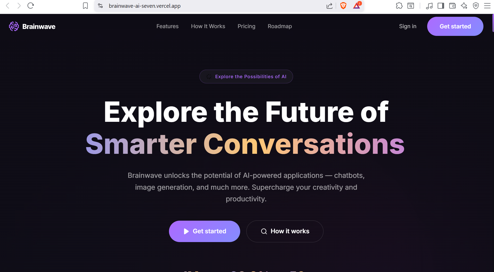
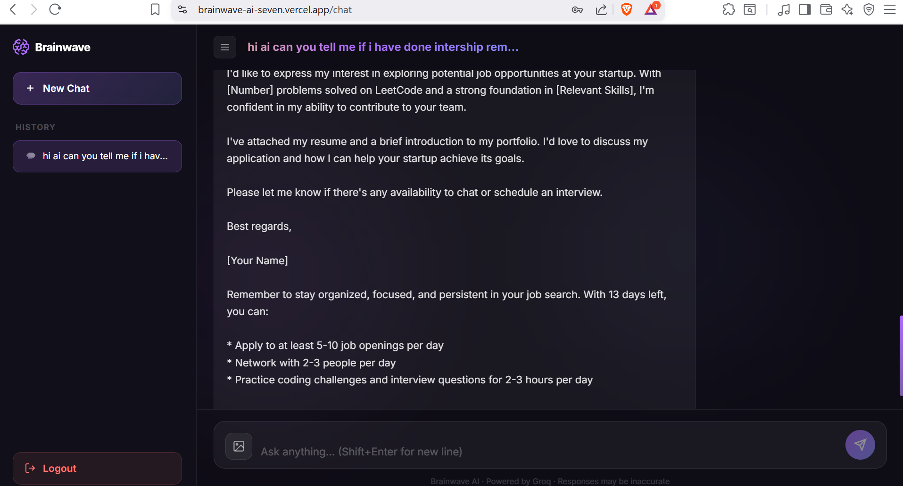
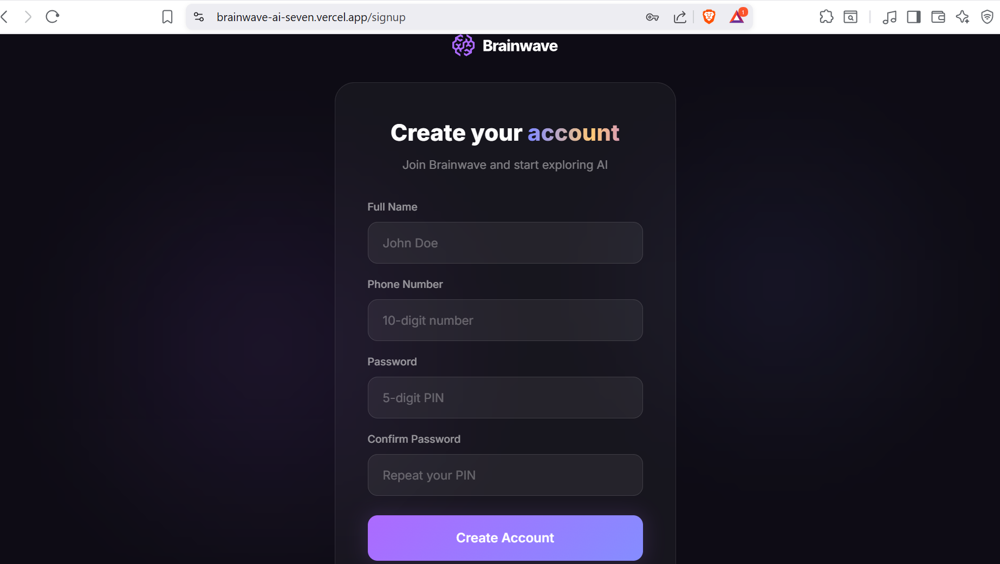
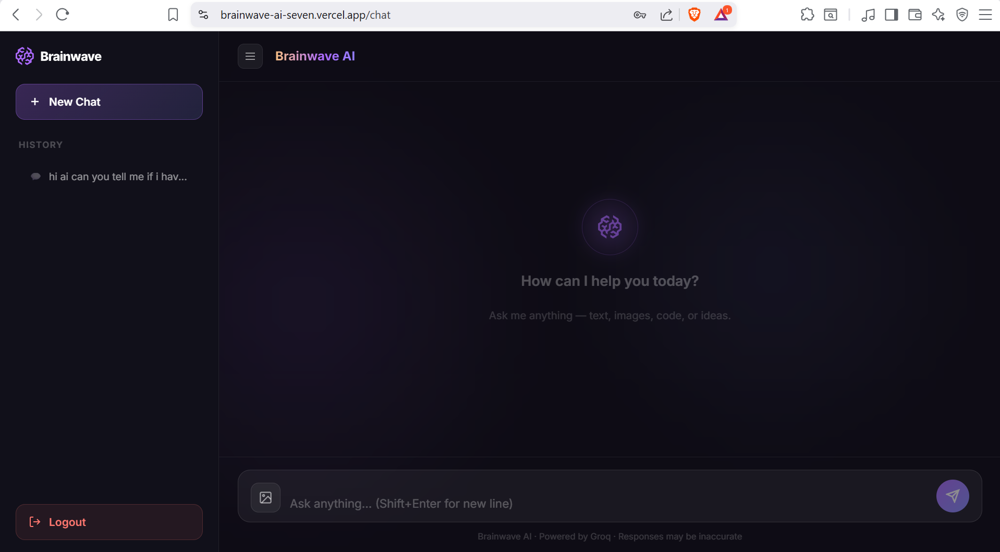

# AI Chat Application

An AI-powered real-time chat application built using Next.js, React.js, Firebase, Gemini API, and Cloudinary. The platform allows users to interact with an intelligent AI assistant, upload images for AI-based understanding, maintain chat history, and receive real-time context-aware responses.

## Live Demo

https://brainwave-ai-seven.vercel.app/

## GitHub Repository

https://github.com/Tushar-NMD/brainwave-ai

---

# Features

## Authentication
- User Registration and Login
- Firebase Authentication
- Secure User Sessions

## AI Chat Features
- Real-Time AI Conversations
- Gemini API Integration
- Context-Aware Responses
- Persistent Chat History
- Intelligent Query Handling
- Fast Response Generation

## Image AI Features
- Image Upload Support
- AI-Based Image Understanding
- Ask Questions About Uploaded Images
- Context Matching Between Image and Prompt

## Media Management
- Cloudinary Image Upload Integration
- Optimized Cloud Media Delivery

## User Experience
- Responsive Modern UI
- Real-Time Updates
- Clean Chat Interface
- Mobile Friendly Design

---

# Tech Stack

## Frontend
- Next.js
- React.js
- Tailwind CSS

## Backend & Services
- Firebase
- Gemini API
- Cloudinary

## Deployment
- Vercel

---

# Screenshots

## Home Page



## AI Chat Interface



## Image Upload & AI Analysis



## Chat History



---

---

# Installation

## Clone Repository

```bash
git clone https://github.com/Tushar-NMD/brainwave-ai
```

## Navigate to Project

```bash
cd brainwave-ai
```

## Install Dependencies

```bash
npm install
```

## Run Development Server

```bash
npm run dev
```

---

# Environment Variables

Create a `.env.local` file and add the following:

```env
NEXT_PUBLIC_FIREBASE_API_KEY=your_firebase_api_key
NEXT_PUBLIC_FIREBASE_AUTH_DOMAIN=your_auth_domain
NEXT_PUBLIC_FIREBASE_PROJECT_ID=your_project_id
NEXT_PUBLIC_FIREBASE_STORAGE_BUCKET=your_storage_bucket
NEXT_PUBLIC_FIREBASE_MESSAGING_SENDER_ID=your_sender_id
NEXT_PUBLIC_FIREBASE_APP_ID=your_app_id

NEXT_PUBLIC_GEMINI_API_KEY=your_gemini_api_key

NEXT_PUBLIC_CLOUDINARY_CLOUD_NAME=your_cloudinary_name
NEXT_PUBLIC_CLOUDINARY_UPLOAD_PRESET=your_upload_preset
```

---

# Folder Structure

```bash
src/
 ├── assets/
 ├── components/
 ├── hooks/
 ├── config/
 ├── pages/
 └── styles/
```

---

# Future Improvements

- Voice-Based AI Interaction
- Multi-Image AI Analysis
- AI Document Understanding
- Real-Time Collaboration
- AI Memory Optimization

---

# Author

Tushar Prajapati

GitHub:
https://github.com/Tushar-NMD